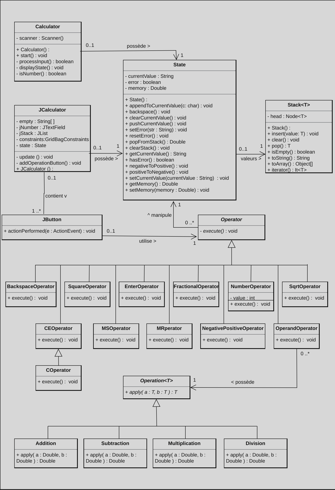

/**
* @file Rapport.md
* @brief Rapport du laboratoire 07 du cours de POO
* @Author Parisod Nathan et Maxime Lestiboudois
* @date 27/11/2024
*/

# POO - Lab07 - Calculatrice

## Table des matières

1. [Schéma UML](#schéma-uml)
2. [Choix de conceptions](#choix-de-conceptions)
    - [Problème 1](#problème-1)
    - [Problème 2](#problème-2)
    - [Problème 3](#problème-3)
3. [Listing de notre code](#listing-de-notre-code)
4. [Tests effectués](#tests-effectués)
5. [Codes sources](#codes-sources)
    - [Code source Solutions](#code-source-solutions)
    - [Code source Tests](#code-source-tests)
6. [Conclusion](#Conclusion)

## Schéma UML

Voici notre schéma le schéma UML complété selon l'implémentation de notre code:

## Choix de conceptions

Lors de ce laboratoire, nous avons eus plusieurs idées pour l'implémentation du code. Voici certaines d'entres-elles et
pourquoi nous les avons choisies:

### Problème 1

### Problème 2

### Problème 3

## Listing de notre code

## Tests effectués

## Codes sources

### Code source Solutions

### Code source Tests

## Conclusion
